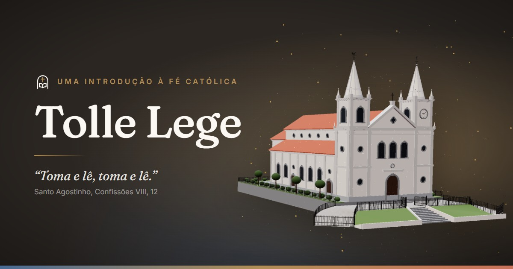

<div align="center">


# Tolle Lege

**Uma introdução à fé católica, no seu ritmo.**

_Tolle, lege_ — “Toma e lê” (Santo Agostinho, _Confissões_ VIII, 12, 29)

[](https://tolle-et-lege.vercel.app)
[](https://react.dev)
[](https://vite.dev)
[](https://www.typescriptlang.org)
[](https://tailwindcss.com)
[](https://r3f.docs.pmnd.rs)

<a href="https://tolle-et-lege.vercel.app">
  
</a>

[**Acessar o site →**](https://tolle-et-lege.vercel.app)

</div>

---

## ✝️ Sobre

O **Tolle Lege** é um caminho simples para conhecer o que a Igreja crê, celebra e vive. Ele foi
pensado para quem está chegando agora, voltando depois de um tempo ou só quer entender melhor:
trilhas para cada história, a Missa passo a passo, liturgia diária, orações, sacramentos e uma
visita guiada por uma igreja em 3D.

## ✨ Destaques

|     | Recurso                  | O que faz                                                                  |
| --- | ------------------------ | -------------------------------------------------------------------------- |
| 🧭  | **Trilhas por perfil**   | Passos curtos para cada história, com o progresso salvo no navegador       |
| ⛪  | **A Missa explicada**    | Cada parte da celebração em ordem, com a postura (de pé, sentado, joelhos) |
| 📖  | **Liturgia diária**      | Leituras do dia e criação de imagem para partilhar nas redes               |
| 📿  | **Orações e terço**      | Orações essenciais e um terço guiado conta a conta                         |
| 🕊️  | **Sacramentos**          | Os sete sacramentos e um guia da Confissão com exame de consciência        |
| 🗓️  | **Ano litúrgico**        | Tempos do ano calculados automaticamente a partir da Páscoa                |
| 🌹  | **Novena das Rosas**     | Aparece sozinha de 22/9 a 1/10, com progresso dos nove dias                |
| 🏛️  | **Visita guiada em 3D**  | A igreja por fora em 3D e a planta por dentro, parada a parada             |

## 🗺️ Páginas

| Rota               | Página                                                |
| ------------------ | ----------------------------------------------------- |
| `/`                | Início                                                |
| `/trails`          | Trilhas por perfil                                    |
| `/trails/:trailId` | Passos de uma trilha (progresso salvo no navegador)   |
| `/mass`            | Como funciona a Missa                                 |
| `/liturgy`         | Liturgia diária, com criação de imagem para partilhar |
| `/faq`             | Dúvidas                                               |
| `/curiosities`     | Curiosidades                                          |
| `/prayers`         | Orações essenciais e terço guiado                     |
| `/sacraments`      | Os sete sacramentos                                   |
| `/liturgical-year` | Ano litúrgico (calculado a partir da Páscoa)          |
| `/confession`      | Guia da Confissão e exame de consciência              |
| `/glossary`        | Glossário da fé                                       |
| `/trinity`         | Santíssima Trindade e heresias antigas                |
| `/rose-novena`     | Novena das Rosas a Santa Teresinha                    |
| `/mary`            | Maria, Mãe de Jesus                                   |
| `/tour`            | Visita guiada: igreja 3D por fora e planta por dentro |

## 🛠️ Tecnologias

- [React](https://react.dev) + [Vite](https://vite.dev) + TypeScript
- [Tailwind CSS v4](https://tailwindcss.com) com tokens de design em `src/styles/index.css`
- [React Router](https://reactrouter.com) (rotas em inglês, páginas carregadas sob demanda)
- [TanStack Query](https://tanstack.com/query) + [axios](https://axios-http.com) para dados remotos
- [Motion](https://motion.dev) para animações (respeita "reduzir movimento")
- [React Three Fiber](https://r3f.docs.pmnd.rs) + [drei](https://drei.docs.pmnd.rs) para o 3D
- [Lucide](https://lucide.dev) para os ícones e [EB Garamond](https://fonts.google.com/specimen/EB+Garamond) + [Inter](https://rsms.me/inter/) como fontes
- [Vercel Analytics](https://vercel.com/analytics) para contar as visitas

## 🚀 Rodando localmente

```bash
npm install
npm run dev      # servidor de desenvolvimento
npm run build    # build de produção (dist/)
npm run preview  # serve o build localmente
npm run lint     # oxlint
```

Opcionalmente, copie o [`.env.example`](.env.example) para `.env` e ajuste o domínio do site:

```bash
VITE_SITE_URL=https://tolle-et-lege.vercel.app   # sem barra no final
```

Sem essa variável, o [`vite.config.ts`](vite.config.ts) usa o domínio oficial.

## ☁️ Deploy (Vercel)

O projeto é uma SPA estática. Na Vercel, basta importar o repositório: o preset **Vite** já
usa `npm run build` e publica a pasta `dist/`.

O [`vercel.json`](vercel.json) redireciona as rotas para o `index.html`, para que links diretos
(ex.: `/mass`) e o F5 em páginas internas funcionem. Arquivos que existem de verdade (modelos,
HDRI, ícones, as páginas geradas no build…) são servidos antes dessa regra.

### 🔗 Prévia dos links e SEO

As tags de compartilhamento (Open Graph) ficam no [`index.html`](index.html) e usam a imagem
[`public/og-image.jpg`](public/og-image.jpg) (1200×630). Como as redes sociais exigem o endereço
completo da imagem, o domínio vem de `VITE_SITE_URL`.

Os robôs das redes não executam JavaScript. Por isso, no build, o plugin
[`seo/pageMetaPlugin.ts`](seo/pageMetaPlugin.ts) gera um `index.html` próprio para cada página
listada em [`seo/pages.ts`](seo/pages.ts), com título e descrição certos, além do
`sitemap.xml` e do `robots.txt`.

> Ao criar uma página nova, acrescente-a também em `seo/pages.ts`.

### 📱 Ícones e PWA

<p>
  
  &nbsp;
  
  &nbsp;
  
  &nbsp;
  
</p>

| Arquivo                                                       | Uso                                                |
| ------------------------------------------------------------- | -------------------------------------------------- |
| [`favicon.svg`](public/favicon.svg)                           | Ícone da aba, com versão para o tema escuro        |
| [`apple-touch-icon.png`](public/apple-touch-icon.png)         | Atalho na tela inicial do iPhone/iPad              |
| [`icon-192.png`](public/icon-192.png) / [`icon-512.png`](public/icon-512.png) | Ícones do app instalado (Android, desktop) |
| [`icon-maskable-512.png`](public/icon-maskable-512.png)       | Versão com margem segura para ícones recortados    |
| [`manifest.webmanifest`](public/manifest.webmanifest)         | Nome, cores e ícones para instalar o site como app |

### 🧊 Modelo 3D

O `.glb` foi otimizado com [glTF Transform](https://gltf-transform.dev) (`dedup`), que
reaproveita as peças idênticas (balaústres, grades…) sem nenhuma perda: de **8,2 MB para 1,6 MB**.
Ao trocar o modelo, repita o processo:

```bash
npx @gltf-transform/cli dedup original.glb public/models/igreja-matriz-nsc.glb
```

## 📁 Estrutura

<details>
<summary>Ver a árvore de pastas</summary>

```
public/
  models/                 # modelo 3D da igreja (.glb)
  hdri/                   # iluminação de ambiente do 3D (HDR), servida pelo próprio site
  og-image.jpg            # imagem de prévia ao compartilhar o link
  favicon.svg, icon-*.png # ícones do site e do app instalado
  manifest.webmanifest    # dados para instalar o site como app (PWA)
seo/
  pages.ts                # título e descrição de cada página (prévias e sitemap)
  pageMetaPlugin.ts       # gera os HTMLs por página, sitemap.xml e robots.txt no build
src/
  app/                    # App (providers), layout raiz e definição das rotas
  config/                 # constantes globais (rotas, navegação)
  components/             # componentes reutilizáveis entre features
    layout/               # Header, Footer, PageHeader, 404…
    ui/                   # peças visuais base (vitral, rosácea, logo, avisos, Reveal…)
  features/               # módulos por domínio; cada um expõe um index.ts
    <feature>/
      pages/              # páginas ligadas a rotas
      components/         # componentes da feature
      hooks/ api/ utils/  # quando necessário
      data.ts             # conteúdo estático da feature
  lib/                    # infraestrutura compartilhada (cliente HTTP, texto…)
  styles/                 # CSS global e tokens de design
  main.tsx                # ponto de entrada
```

</details>

**Features:** `home`, `trails`, `mass`, `liturgy`, `faq`, `curiosities`, `prayers`, `sacraments`,
`liturgical-year`, `confession`, `glossary`, `trinity`, `rose-novena`, `mary`, `tour` e
`church` (igreja em partículas da hero).

**Convenções:**

- A navegação (menu e rodapé) é gerada a partir de `navGroups` em `src/config/routes.ts`.
- Imports internos usam o alias `@/` → `src/`.
- Uma feature só importa outra pelo seu `index.ts`.

## ✍️ Conteúdo

- Os textos ficam nos arquivos `data.ts` de cada feature, para editar sem mexer nos componentes.
- O site é uma introdução: as páginas lembram que cada caso é único e deve ser tratado com a
  secretaria paroquial e o padre.
- A Novena das Rosas aparece automaticamente de 22/9 a 1/10 de cada ano.

## 🙏 Créditos

- **Modelo 3D:** igreja inspirada na Igreja Matriz de Resende (RJ).
- **Liturgia diária:** [API Liturgia Diária](https://liturgia.up.railway.app).
- **Iluminação 3D:** HDRI _Potsdamer Platz_, do [Poly Haven](https://polyhaven.com) (CC0),
  distribuído pelo [drei-assets](https://github.com/pmndrs/drei-assets).

<div align="center">
  <br />
  
  <br />
  <sub><i>Ad maiorem Dei gloriam</i></sub>
</div>
